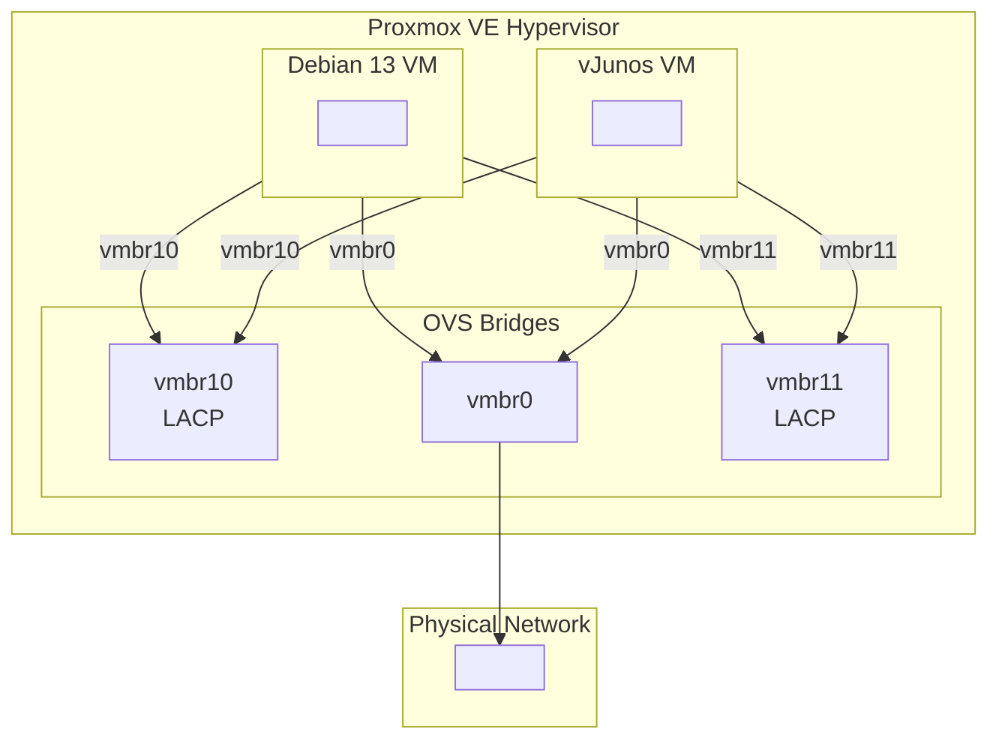
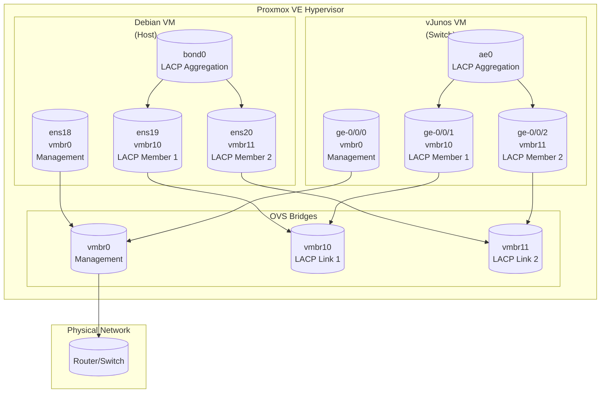

# Lab: Debian Server and vJunos Switch in Proxmox with LACP
</br></br>
## Document Information

| Item               | Value                                                          |
| ------------------ | -------------------------------------------------------------- |
| Category           | LAB                                                            |
| Document ID        | LAB-001                                                        |
| Version            | 1.0                                                            |
| Status             | Draft                                                          |
| Audience           | Network Engineers, System Administrators, Home Lab Enthusiasts |
| Operating System   | Proxmox VE 9.2.3                                               |
| Operating System   | Debian 13.5 (Trixie) amd64                                     |
| Operating System   | JUNOS 26.2R1.7                                                 |
| Estimated Time     | 75–90 minutes                                                  |

---

</br>

## Table of Contents
1. [Objective](#objective)
2. [Lab Architecture](#lab-architecture)
3. [Preparations](#preparations)
   - [3.1 Downloads](#31-downloads)
   - [3.2 Upload Debian ISO to Proxmox](#32-upload-debian-iso-to-proxmox)
   - [3.3 Upload vJunos Image to Proxmox](#33-upload-vjunos-image-to-proxmox)
4. [Installations](#installations)
   - [4.1 Proxmox VE Assumptions](#41-proxmox-ve-assumptions)
   - [4.2 Debian VM](#42-debian-vm)
   - [4.3 vJunos VM](#43-vjunos-vm)
5. [Configurations](#configurations)
   - [5.1 Proxmox OVS Bridges](#51-proxmox-ovs-bridges)
   - [5.2 Debian Network Bonding (LACP)](#52-debian-network-bonding-lacp)
   - [5.3 vJunos LACP Configuration](#53-vjunos-lacp-configuration)
6. [Verification & Troubleshooting](#verification-troubleshooting)
   - [6.1 Commands on Proxmox](#61-commands-on-proxmox)
   - [6.2 Commands on Debian](#61-commands-on-debian)
   - [6.3 Commands on JunOS](#61-commands-on-junos)
7. [VLAN Extension (Optional)](#82-vlan-extension-optional)

---

</br>

## Objective

The objective of this document is to deploy a Debian Server and a vJunos Switch within a Proxmox Virtual Environment (PVE). Once both virtual machines have been successfully provisioned, a series of networking configurations will be implemented. Starting with a basic setup, the environment will be progressively expanded to introduce and demonstrate key networking technologies such as Link Layer Discovery Protocol (LLDP), Link Aggregation Control Protocol (LACP), and Virtual Local Area Networks (VLANs). This step-by-step approach is designed to provide a practical understanding of these concepts and their implementation in a virtualized network environment.
```text

+------------------------------------------------------------------+
|                                                                  |
|                           Proxmox VE                             |
|                           Hypervisor                             |
|                                                                  |
|       +---------------+               +---------------+          |
|		|               |-----vmbr10----|               |          |
|       | Debian 13 VM  |               |   vJunos VM   |          |
|		|               |-----vmbr11----|               |          |
|       +---------------+               +---------------+          |
|               |                               |                  |
|               +-------------vmbr0-------------+                  |
|                               |                                  |
--------------------------------+----------------------------------+
                                |
                         Physical Network
```

---

</br>

## Lab Architecture

The diagram below illustrates the virtual lab environment that will be used throughout this guide. The environment is hosted on a single Proxmox VE hypervisor and consists of a Debian 13 virtual machine and a vJunos virtual switch.

Both virtual machines are connected to three virtual bridges. The **vmbr0** bridge provides management connectivity and is connected to the physical network, allowing access from the management workstation as well as internet connectivity when required. This bridge is typically configured to obtain network settings through DHCP.


In summary:

- **Debian 13 VM** acts as the Linux host.
- **vJunos VM** acts as the virtual switch.
- **vmbr0** provides management and external network access.
- **vmbr10** and **vmbr11** are dedicated LACP member links.
- The physical network is reachable through **vmbr0**.
- The topology serves as the foundation for the exercises described in this document.




The **vmbr10** and **vmbr11** bridges are dedicated to the data plane and are used to establish an LACP-based link aggregation between the Debian host and the vJunos switch. These two independent Layer 2 connections will later be combined into a single logical link using **bond0** on Debian and **ae0** on the vJunos device. This configuration provides a practical platform for learning technologies such as LLDP, LACP, and VLANs.



---

</br>

# Preparations

</br>

## 3.1 Downloads:

| FileName                        | Link                                                             |
| ------------------------------- | ---------------------------------------------------------------- |
| proxmox-ve_9.2-1.iso            | https://www.proxmox.com/en/downloads/proxmox-virtual-environment |
| vJunos-switch-26.2R1.7.qcow2    | https://support.juniper.net/support/downloads/?p=vjunos-switch   |
| debian-13.5.0-amd64-netinst.iso | https://www.debian.org/download                                  |

---

</br>

## 3.2 Upload Debian ISO to Proxmox

### 1. Access the Proxmox Web Interface

Open a web browser and navigate to:
```text
https://<proxmox-ip>:8006
```

### 2. Navigate to the ISO Storage

In the left navigation pane, browse to:

- **Datacenter**
  - **<Proxmox Node>**
    - **local** (or your preferred storage)
      - **ISO Images**

### 3. Upload the ISO Image

Click **Upload** and select the previously downloaded **debian-12.5.0-amd64-netinst.iso** file from your local system.

### 4. Wait for the Upload to Complete

Monitor the upload progress and wait until the task finishes successfully. The task status should display **OK**.

### 5. Verify the Upload

✅ Confirm that the Debian 13 ISO is listed under **ISO Images** and is available for use when creating a new virtual machine.

> **Note:** If the ISO does not appear immediately, refresh the Proxmox web interface and check the storage location again.


---

</br>


## 3.3 Upload vJunos Image to Proxmox

### 1. Transfer the Image to the Proxmox Host

Copy the vJunos QCOW2 image to the Proxmox server using SCP or another file transfer method. Windows users can alternatively use graphical tools such as **WinSCP** or **FileZilla**.

Example:

```bash
# Linux/macOS (Terminal)
scp [PATH]/vJunos-switch-26.2R1.7.qcow2 root@<proxmox-ip>:/var/lib/vz/images/
```

### 2. Verify the Uploaded Image

After transferring the file, connect to the Proxmox host via SSH and verify that the image was uploaded successfully.

First, confirm that the file is present:

```bash
ls -lh /var/lib/vz/images/
```

Next, calculate the SHA256 checksum of the uploaded image:

```bash
sha256sum /var/lib/vz/images/vJunos-switch-26.2R1.7.qcow2
```

Example output:

```text
d2f6e6d3e7ab1234567890abcdef1234567890abcdef1234567890abcdef12  vJunos-switch-26.2R1.7.qcow2
```

Compare the resulting checksum with the SHA256 hash provided by Juniper for the downloaded image.

> ✅ **Verification:** The calculated SHA256 checksum matches the checksum published by Juniper, confirming that the image was downloaded and transferred without corruption.


---

</br>


# Installations

</br>

## 4.1 Proxmox VE Assumptions

This guide assumes that a fully operational Proxmox Virtual Environment (PVE) is already in place. A Linux bridge, **vmbr0**, should be configured and connected to both the internet and the local management network, allowing access from a workstation or management host. In addition, **vmbr0** is expected to be connected to a DHCP-enabled network that provides IP addressing, a default gateway, and DNS services to newly deployed virtual machines.
Before proceeding with the remainder of this guide, verify that the Proxmox installation is functioning correctly. The environment is considered ready when you can successfully access and log in to the **Proxmox Web Interface** using the following URL:
```text
https://<proxmox-ip>:8006
```

---

</br>

## 4.2 Debian VM

This guide provides clear, step-by-step instructions for installing **Debian 13** as a virtual machine (VM) in **Proxmox VE**.

---

## Create New Virtual Machine

1. In the Proxmox web interface, click **`Create VM`** (top-right corner).

2. Configure the VM with the following settings:

 | **Setting**       | **Value**               | **Note**                          |
 |-------------------|-------------------------|-----------------------------------|
 | VM ID             | `801` (or next available) | Unique per Proxmox node         |
 | Name              | `deb-lab-01`            | Choose a descriptive name         |
 | Tags              | `LAB`                   | Optional tags        |
 | Start at boot     | `no`                    | Config change needed              |
 | ISO               |debian-13.5.0-amd64-netinst.iso   | Select under `ISO Image` |
 | Machine           | `q35`                   | advised                           |
 | BIOS              | `SeaBIOS` or 'OVMF(UEFI)'                    | Optional tags        |
 | Qemu Agent        | `yes`                   | Advised                           |
 | Hard Disk         | `20 GiB` (or more)      | Use **`virtio`** storage controller(I used SCSI)|
 | CPU               | `2 cores`               | Type = host         |
 | Memory            | `2048 MiB` (2 GB)       | Minimum for basic installation    |
 | Network           | `virtio`                | For best performance              |
 | Bridge            | `vmbr0`                 | Default network bridge            |
 | Guestding         | `yes`                   | Guest           |


4. Click **`Finish`** to create the VM.
5. 💡Add 2 interfaces with vmbr10 and vmbr11. Choose no firewall and make them E1000. This is very important, otherwsie LACP will not work, because the driver for VirtIO does not understand LACP packets. You see weird things.

---

## Install Debian 13

### Step 1: Start VM and Launch Installer

1. Select the new VM (`debian13-server`) in the Proxmox web interface.
2. Click **`Console`** (or **`>_ Shell`**) to open the console.
3. Click **`Start`** to power on the VM.
4. The Debian installer starts automatically. Select **`Graphical install`** (or **`Install`** for text mode).

---

### Step 2: Language and Region Settings
 | **Option**       | **Selection**       | **Note**                          |
 |------------------|---------------------|-----------------------------------|
 | Language         | `English`           | Or your preferred language       |
 | Country          | `Netherlands`       | For timezone and keyboard settings |
 | Locale           | `en_US.UTF-8`       | UTF-8 encoding                    |
 | Keyboard         | `us`                | Or `nl` for Dutch layout          |

---

### Step 3: Network Configuration
 | **Option**       | **Value**            | **Note**                          |
 |------------------|----------------------|-----------------------------------|
 | Hostname         | `deb-lab-01`         | Or a unique name (e.g., `server01`) |
 | Domain name      | `local`              | Leave empty for local use        |
 | IPv4             | `DHCP`               | Or configure a **static IP**      |
 | IPv6             | `No`                 | Unless you use IPv6               |


---
### Step 4: User Accounts and Passwords
 | **Option**       | **Action**           | **Note**                          |
 |------------------|----------------------|-----------------------------------|
 | Root password    | Leave empty          | Login with username !               |
 | Full name        | Harry Warry          | Optional                          |
 | Username         | `harry`              | User for daily operations        |
 | User password    | Set a password       | Different from root password      |

---
### Step 5: Disk Partitioning

1. Choose **`Guided - use entire disk`** (for beginners) or **`Manual`** (for advanced users).
2. Select the virtual disk (e.g., `/dev/vda`).
3. Choose **`All files in one partition`** (recommended for VMs).
4. Confirm the changes and write to disk.

---
### Step 6: Package Selection

1. **Deselect** all options except `standard system utilities`.
   - Debian 13 installs a minimal environment by default.
2. Select **`SSH server`** you need remote access.
3. Click **`Continue`** to start the installation.

> ⏳ **Estimated Time:** The installation takes **5–15 minutes**, depending on your hardware and network speed.

---
### Step 7: Install Bootloader

1. Select **`Yes`** to install the GRUB bootloader on `/dev/vda`.
2. Choose **`/dev/vda`** as the installation location.

---
---
## First Boot and Login

1. After completing the installation, click **`Finish the installation`**.
2. The VM restarts automatically. Close the console and restart the VM via Proxmox if needed.

3. Open the console and log in with your credentials:
   ```bash
   Username: harry
   Password: <your password>

Verify the installation by running:
cat /etc/debian_version

Expected output:
13.0

Check the ip address, type : ip address

You now can login via ssh 


---

</br>

## 4.3 vJunos VM

To deploy the vJunos virtual switch, log in to the Proxmox host using your preferred SSH client. Once connected, create or modify the virtual machine configuration file and apply the configuration shown below.

### The configuration provisions a vJunos instance with:

```bash
# Create VM 701 for vJunos
qm create 701 \
  --name SWITCH-1 \
  --ostype l26 \
  --memory 5120 \
  --cores 4 \
  --sockets 1 \
  --net0 virtio=CA:FE:BA:BE:AA:01,bridge=vmbr0 \
  --net1 virtio=CA:FE:BA:BE:BB:01,bridge=vmbr10 \
  --net2 virtio=CA:FE:BA:BE:CC:01,bridge=vmbr11

# Import the vJunos disk image
qm importdisk 701 /var/lib/vz/images/vJunos-switch-26.2R1.7.qcow2 VM-POOL --format=qcow2

# Attach the disk and configure boot
qm set 701 --sata0 VM-POOL:vm-604-disk-0
qm set 701 --boot order=sata0
qm set 701 --cpu host
qm set 701 --args "-cpu 'host,+sse4.2,+aes'"
qm set 701 --serial0 socket
qm set 701 --machine q35

# Below 2 commands are not tested yet, it work leaving them out
qm set 701 --kvm 1
qm set 701 --hidden 1  # Critical for vJunos dataplane
```


This will give you the following:

- **4 vCPUs**
- **5 GB RAM**
- **Q35 machine type**
- **One management interface** connected to **vmbr0**
- **Two data interfaces** connected to **vmbr10** and **vmbr11** for the LACP lab
- **Virtual disk** attached through the VM storage pool

> **Note:** Adjust the VM ID, VM name and storage location to match your environment.
> **Note:** Make sure you add enough cpu/ram, otherwise the dataplane will not work!


### Network Interface Mapping

| Interface | Bridge | Purpose |
|------------|---------|---------|
| net0 | vmbr0 | Management |
| net1 | vmbr10 | LACP Member Link 1 |
| net2 | vmbr11 | LACP Member Link 2 |

### Verification

After starting the virtual machine, verify that:

- The VM reaches the **Running** state.
- A console session can be opened from the Proxmox web interface.
- The management interface receives an IP address.
- All three virtual interfaces are visible within the vJunos operating system.
- If the datapane is not working you have not sufficient resources(CPU/RAM).

Once these checks have been completed successfully, you can continue with the initial vJunos configuration and the LACP setup described in the next sections.

From the Proxmox terminal you can logon with:
```bash
qm terminal 701
```

---

</br>


# Configurations

---

</br>

## 5.1 Proxmox OVS Bridges

Configure vmbr10 and vmbr11 for LACP traffic:

```bash
# Create OVS bridges for LACP
ovs-vsctl add-br vmbr10
ovs-vsctl add-br vmbr11

# Enable other-config needed for LLDP
ovs-vsctl set Bridge vmbr10 other-config:forward-bpdu=true
ovs-vsctl set Bridge vmbr11 other-config:forward-bpdu=true

#Enable below. It my test I did not use them, needs a look
ovs-vsctl set bridge vmbr10 other-config:disable-in-band=true
ovs-vsctl set bridge vmbr10 other-config:enable-8021q=true
ovs-vsctl set bridge vmbr11 other-config:disable-in-band=true
ovs-vsctl set bridge vmbr11 other-config:enable-8021q=true

# Verificatie
ovs-vsctl show

```

---

</br>

## 5.2 Debian Network Bonding (LACP)


## 🔧 Post-installatie configuratie

### 1. Systeem updaten
Voer de volgende commando's uit als **root** of met `sudo`:
```bash
sudo apt update && sudo apt upgrade -y
sudo apt dist-upgrade -y
sudo apt autoremove -y
```

### 3. Netwerkconfiguratie (statisch IP)
Als je een **statisch IP** wilt instellen, bewerk het netwerkconfiguratiebestand:
```bash
sudo nano /etc/network/interfaces
```
**Voorbeeldconfiguratie (voor `ens18` of `vmbr0`):**
```ini
auto ens18
iface ens18 inet static
    address 192.168.1.100
    netmask 255.255.255.0
    gateway 192.168.1.1
    dns-nameservers 8.8.8.8 8.8.4.4
```
> ⚠️ **Opmerking:** Vervang `ens18` door je netwerkinterface (check met `ip a`).
> Pas de service toe:
> ```bash
> sudo systemctl restart networking
> ```
>
> 
```text
# /etc/network/interfaces
auto eth1
iface eth1 inet manual
    bond-master bond0

auto eth2
iface eth2 inet manual
    bond-master bond0

auto bond0
iface bond0 inet manual
    bond-slaves eth1 eth2
    bond-mode 4       # 802.3ad (LACP)
    bond-miimon 100   # Monitoring interval (ms)
    bond-lacp-rate 1  # Fast LACP rate
    bond-updelay 0
    bond-downdelay 0
```

    
---

</br>

## 5.3 vJunos LACP Configuration

```text
configure
set system host-name vJunOS-1
set system root-authentication plain-text-password "<wachtwoord>"
delete chassis auto-image-upgrade
set system services ssh
set system services ssh root-login allow


set system domain-name lab.local
set system time-zone Europe/Amsterdam
set system login user admin class super-user authentication plain-text-password "<wachtwoord>"
set system services netconf ssh
set system syslog file messages any any
set system syslog file messages match RT_ALL
set system commit synchronize


set interfaces ge-0/0/0 ether-options 802.3ad ae0
set interfaces ge-0/0/1 ether-options 802.3ad ae0
set interfaces ae0 aggregated-ether-options lacp active
set interfaces ae0 unit 0 family ethernet-switching

# Set LACP on ge-0/0/0 and ge-0/0/1
set interfaces ge-0/0/0 ether-options 802.3ad ae0
set interfaces ge-0/0/1 ether-options 802.3ad ae0

# Configure ae0
set interfaces ae0 aggregated-ether-options lacp active
set interfaces ae0 aggregated-ether-options lacp periodic fast
set interfaces ae0 unit 0 family ethernet-switching

# Enable LLDP (voor troubleshooting)
set protocols lldp interface all
set protocols lldp management-address 192.168.1.2
```


Verify LACP Status

```junos
show lacp interfaces
show lacp statistics
show lldp neighbors
show ethernet-switching table
```

---

</br>


## Verification & Troubleshooting

---

</br>

## 6.1 Commands on Proxmox
Configureer 2 ovs bridges met extended opties voor bpdu
root@proxmox:~# ovs-vsctl get Bridge vmbr10 other_config


---

</br>

## 6.2 Commands on Debian

| Commando | Beschrijving |
|----------|--------------|
| `lsb_release -a` | Toont Debian-versie en codenaam |
| `uname -a` | Toont kernel-versie |
| `df -h` | Toont schijfgebruik |
| `free -h` | Toont geheugengebruik |
| `ip a` | Toont netwerkinterfaces |
| `sudo apt search <pakket>` | Zoekt naar pakketten |
| `sudo systemctl list-units --type=service` | Toont actieve services |
| `sudo journalctl -xe` | Toont systeemlogs |


---

</br>

## 6.3 Commands on vJunOS

| Problem | Reason | Solution |
| --- | --- | --- |
| vJunos start niet op | Onvoldoende CPU/RAM | Minimaal 4 vCPUs, 5GB RAM |
| LACP komt niet omhoog | Verkeerde bond-mode | Gebruik bond-mode 4 (802.3ad) |
| Geen connectiviteit vmbr10/11 | OVS bridge niet geconfigureerd | ovs-vsctl show controleren |
| vJunos geef geen IP | DHCP niet beschikbaar op vmbr0 | Statisch IP configureren |
| Debian herkent netwerk niet | Verkeerde driver | Gebruik virtio voor netwerk |
| vJunos dataplane werkt niet | Missing kvm: hidden=1 | Voeg toe aan VM config |

---

</br>


## VLAN Extension (Optional)

### Add VLAN 10 to the LACP port-channel
**On vJunos**
```
set vlans vlan10 vlan-id 10
set interfaces ae0 unit 10 family ethernet-switching vlan members vlan10
set interfaces ae0 unit 10 family ethernet-switching vlan tagging
```

**On Debian**
```
apt install vlan
echo "8021q" >> /etc/modules
modprobe 8021q
vconfig add bond0 10
ifconfig bond0.10 192.168.10.1 netmask 255.255.255.0 up
```


