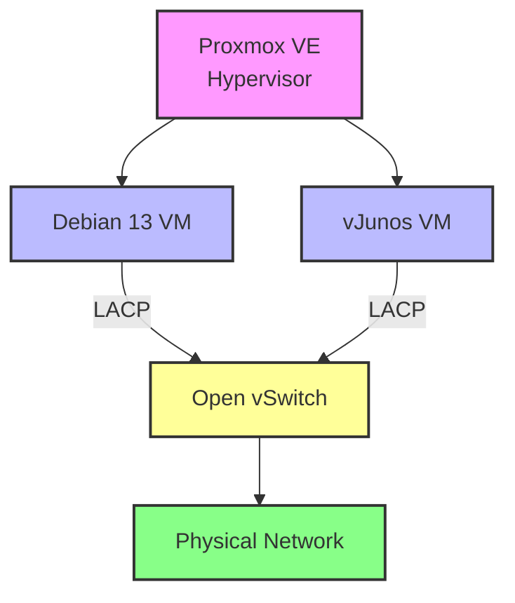

# Deploying a Debian Server and vJunos Switch in Proxmox

---

## Document Information

| Item               | Value                                                          |
| ------------------ | -------------------------------------------------------------- |
| Category           | LAB                                                            |
| Document ID        | LAB-001                                                        |
| Version            | 1.0                                                            |
| Status             | Draft                                                          |
| Audience           | Network Engineers, System Administrators, Home Lab Enthusiasts |
| Operating System   | Proxmox VE 9.2.3                                               |
| Operating System   | Debian 13.5 (Trixie) amd64                                     |
| Operating System   | JUNOS 26.2R1.7                                                 |
| Estimated Time     | 75–90 minutes                                                  |

---


## Objective

The objective of this document is to deploy a Debian Server and a vJunos Switch within a Proxmox Virtual Environment (PVE). After both virtual machines have been provisioned, an LACP (Link Aggregation Control Protocol) configuration will be implemented to provide link redundancy and increased bandwidth between the Debian server and the vJunos switch.

---


## Downloads:

| Item                            | Value                                                            |
| ------------------------------- | ---------------------------------------------------------------- |
| proxmox-ve_9.2-1.iso            | https://www.proxmox.com/en/downloads/proxmox-virtual-environment |
| vJunos-switch-26.2R1.7.qcow2    | https://support.juniper.net/support/downloads/?p=vjunos-switch   |
| debian-13.5.0-amd64-netinst.iso | https://www.debian.org/download                                  |

---


# Objective

This document describes how to deploy a minimal Debian 13 virtual machine on Proxmox VE as the foundation for a networking laboratory.

Unlike a generic Debian installation guide, this document focuses on building a reusable platform for networking experiments and infrastructure testing.

The completed virtual machine will be used throughout this documentation series for technologies including:

* Linux networking
* Linux Bonding
* IEEE 802.3ad (LACP)
* VLAN implementation
* Open vSwitch
* Juniper vJunos
* Packet captures
* Network troubleshooting

By the end of this guide you will have a clean, fully updated Debian installation that is ready for further configuration.

---

# Background

Modern networking laboratories require systems that are predictable, lightweight and easy to rebuild.

Rather than installing unnecessary software, this guide follows a minimal installation philosophy.

Only components that are required for future networking exercises are installed.

This approach provides several advantages:

* Faster deployment
* Smaller attack surface
* Easier troubleshooting
* Lower resource consumption
* Better understanding of the operating system

Every chapter that follows builds upon this installation.

For that reason, consistency during deployment is essential.

---

# Why Debian?

Debian has been selected as the primary Linux distribution for this project because it combines stability with long-term maintainability.

For networking laboratories, predictable behaviour is significantly more valuable than having the newest software versions.

Debian provides:

* Long-term stability
* Excellent package management
* Extensive community documentation
* Reliable security updates
* Minimal default installation
* Broad hardware and virtualization support

Because Debian is widely used in production environments, the knowledge gained in this laboratory directly translates to real-world systems.

---

# Lab Architecture

The Debian virtual machine is only one component of the complete laboratory environment.

The simplified topology is shown below.

```text
                     +----------------------+
                     |     Proxmox VE       |
                     |      Hypervisor      |
                     +----------+-----------+
                                |
                +---------------+---------------+
                |                               |
        +---------------+               +---------------+
        | Debian 13 VM  |               |   vJunos VM   |
        +---------------+               +---------------+
                |                               |
                +----------- LACP --------------+
                                |
                        Open vSwitch
                                |
                           Physical Network
```



Throughout this documentation additional virtual machines, VLANs and services will be added without changing this fundamental design.

---

# Design Philosophy

This repository follows several principles.

## Keep It Minimal

Every installed package should have a purpose.

Unused software increases complexity without providing value.

---

## Build Incrementally

The operating system should first be installed and verified.

Only after validation will additional software be introduced.

Examples include:

* OpenSSH Server
* QEMU Guest Agent
* tcpdump
* ethtool
* lldpd
* bridge-utils

Each component will be documented in a separate chapter.

---

## Document Everything

Configuration changes should never rely on memory.

Every important decision should be documented, including:

* Why a specific setting was chosen
* Why an alternative was rejected
* Any deviations from the standard lab design

---

# Prerequisites

Before beginning the installation, verify that the following requirements have been met.

## Hardware Requirements

Recommended minimum resources.

| Component          | Recommended                 |
| ------------------ | --------------------------- |
| CPU                | 2 vCPUs                     |
| Memory             | 4 GB                        |
| Storage            | 20 GB                       |
| Network Interfaces | 2 VirtIO adapters (minimum) |
| Firmware           | UEFI or BIOS                |
| Machine Type       | q35                         |

Additional interfaces may be added later for advanced networking exercises.

---

## Software Requirements

The following software should already be available.

| Software                | Purpose                       |
| ----------------------- | ----------------------------- |
| Proxmox VE 9.x          | Virtualization platform       |
| Debian 13.5 Netinst ISO | Operating system installation |
| Internet connectivity   | Package installation          |
| Administrative access   | Proxmox management            |

---

# Installation Philosophy

The objective is **not** to build a production server.

The objective is to create a clean engineering platform that can safely be modified, broken, restored and rebuilt during laboratory exercises.

Whenever possible:

* Keep the installation reproducible.
* Prefer simplicity over unnecessary optimisation.
* Validate every configuration step.
* Document observations while working.

---

# Expected Result

After completing this chapter, the virtual machine will provide:

* A minimal Debian 13 installation
* Internet connectivity
* SSH access
* Updated packages
* Stable baseline configuration

This system will serve as the foundation for every networking lab described in subsequent chapters.

---

# Lab Notes

Use this section to record information specific to your own environment.

Examples include:

* Proxmox node name
* VM ID
* Hostname
* Static IP address
* VLAN assignments
* Storage location
* Snapshot names

Keeping these notes together with the documentation makes future maintenance considerably easier.

---

## Installation of Debian

## Installation of vJunOS

## Configurations


# Deploying a Debian Server and vJunos Switch in Proxmox with LACP Configuration

## Objective

The objective of this document is to deploy a Debian Server and a vJunos Switch within a Proxmox Virtual Environment (PVE). After both virtual machines have been provisioned, an LACP (Link Aggregation Control Protocol) configuration will be implemented to provide link redundancy and increased bandwidth between the Debian server and the vJunos switch.

---

## Background

Link aggregation is a commonly used technology in enterprise and datacenter networks to combine multiple physical connections into a single logical interface.

Benefits include:

- Increased network availability
- Link redundancy
- Improved bandwidth utilization
- Simplified network management
- Automatic failover capabilities

This lab environment consists of:

- Proxmox VE as the virtualization platform
- Debian Linux as the server operating system
- vJunos Switch as the virtual network switch
- LACP (IEEE 802.3ad) as the aggregation protocol

---

## Prerequisites

### Software Requirements

- Proxmox VE installed and operational
- Debian Server ISO image
- vJunos Switch image
- Administrative access to Proxmox

### Knowledge Requirements

- Basic Linux administration skills
- Basic Junos CLI knowledge
- Understanding of Ethernet switching
- Understanding of VLANs
- Understanding of Link Aggregation and LACP

### Infrastructure Requirements

- Sufficient CPU, memory, and storage resources
- At least two virtual network interfaces between the Debian VM and the vJunos VM
- Management network connectivity for both virtual machines

---

## Theory

### Link Aggregation

Link Aggregation combines multiple physical interfaces into one logical connection. This increases bandwidth and provides redundancy in case of a link failure.

Advantages include:

- Improved fault tolerance
- Higher throughput
- Load balancing across multiple links

### Link Aggregation Control Protocol (LACP)

LACP is an IEEE 802.3ad standard that dynamically manages aggregated links between devices.

Key concepts:

- Link Aggregation Group (LAG)
- Active and Passive LACP modes
- Automatic member negotiation
- Failure detection and recovery

### Aggregated Ethernet on Junos

Junos uses Aggregated Ethernet (AE) interfaces to bundle multiple physical interfaces into a single logical interface.

Example:

- ge-0/0/0
- ge-0/0/1
- ae0

### Linux Bonding

Linux bonding allows multiple network interfaces to operate as a single logical interface.

Common bonding modes include:

- balance-rr
- active-backup
- 802.3ad (LACP)
- balance-alb

This guide uses **802.3ad (LACP)** mode.

---

## Configuration

### 1. Deploy the Debian Virtual Machine

#### Create the VM

- Create a new VM in Proxmox.
- Assign CPU, memory, and storage resources.
- Mount the Debian ISO image.
- Install Debian.
- Configure management connectivity.
- Add two network interfaces dedicated to LACP.

#### Deployment Details

```text
VM ID:
Hostname:
Management IP:
LACP NIC 1:
LACP NIC 2:


# 📖 Handleiding: Debian 13 (Trixie) Installeren op Proxmox VE

---
**Versie:** 1.0
**Laatste update:** 9 juli 2026
**Doelgroep:** Beheerders, ontwikkelaars, sysadmins
**Geschatte tijd:** 20–30 minuten

---

---

## 📌 Inleiding
Deze handleiding begeleidt je stap voor stap bij het installeren van **Debian 13 (codenaam: *Trixie*)** als virtuele machine (VM) in **Proxmox VE** (9.x of 10.x). Debian 13 biedt de nieuwste stabiliteit, beveiligingsupdates en pakketversies, ideaal voor servers, ontwikkelomgevingen of productie-omgevingen.
De stappen zijn gebaseerd op de [gids voor Debian 12 op Proxmox VE 9](https://www.dropvps.com/blog/install-debian-12-on-proxmox-ve-9), maar zijn **aangepast voor Debian 13** en aangevuld met best practices voor optimalisatie.

---

---

## ⚙️ Voorbereiding

### Vereisten
| Onderdeel | Minimaal | Aanbevolen |
|-----------|----------|------------|
| **Proxmox VE** | 8.x of hoger | 9.x/10.x (laatste versie) |
| **CPU** | 1 core | 2+ cores |
| **RAM** | 1 GB | 2 GB+ (4 GB voor zware workloads) |
| **Opslag** | 10 GB | 20 GB+ (SSD/NVMe) |
| **Netwerk** | DHCP/Static IP | VLAN-ondersteuning (optioneel) |
| **ISO** | [Debian 13 (Trixie) ISO](https://www.debian.org/download) | `debian-13.0.0-amd64-netinst.iso` of `debian-13.0.0-amd64-DVD-1.iso` |

> ⚠️ **Tip:** Gebruik de **netinst**-ISO voor een minimale installatie (ca. 300 MB) of de **DVD-1**-ISO voor een complete offline installatie.

---

### Stappenoverzicht
1. [Debian 13 ISO downloaden en uploaden naar Proxmox](#1-debian-13-iso-uploaden-naar-proxmox)
2. [Nieuwe VM aanmaken in Proxmox](#2-nieuwe-vm-aanmaken)
3. [Debian 13 installeren via de installer](#3-debian-13-installeren)
4. [Eerste opstart en inloggen](#4-eerste-opstart-en-inloggen)
5. [Post-installatie configuratie](#5-post-installatie-configuratie)
6. [Optimalisaties voor Proxmox](#6-optimalisaties-voor-proxmox)

---

---

## 🚀 Installatieproces

---

### 1️⃣ Debian 13 ISO uploaden naar Proxmox
#### Stap 1: ISO downloaden
1. Ga naar de [officiële Debian downloadpagina](https://www.debian.org/download).
2. Kies de **64-bit (amd64)** versie van **Debian 13 (Trixie)**.
   - Voor een minimale installatie: `debian-13.0.0-amd64-netinst.iso`
   - Voor een complete installatie: `debian-13.0.0-amd64-DVD-1.iso`
3. Download de ISO naar je lokale machine.

#### Stap 2: ISO uploaden naar Proxmox
1. Log in op de **Proxmox webinterface** (`https://<proxmox-ip>:8006`).
2. Navigeer naar:
   **`Datacenter` → `<Jouw Proxmox-node>` → `local (of andere opslag)` → `ISO Images`**.
3. Klik op **`Upload`** en selecteer de gedownloade Debian 13 ISO.
   - Wacht tot de upload voltooid is (status: **"OK"**).

> ✅ **Verificatie:** Controleer of de ISO zichtbaar is in de lijst onder `ISO Images`.

---

---

### 2️⃣ Nieuwe VM aanmaken
1. Klik in de Proxmox webinterface op **`Create VM`** (rechterboven).
2. Vul de volgende gegevens in:

   | Instelling | Waarde | Opmerking |
   |------------|--------|-----------|
   | **VM ID** | `100` (of volgende vrije ID) | Uniek per Proxmox-node |
   | **Naam** | `debian13-server` | Kies een duidelijke naam |
   | **OS** | Selecteer de geüploade **Debian 13 ISO** | Onder `ISO Image` |
   | **Hard Disk** | `20 GiB` (of meer) | Gebruik **`virtio`** als opslagcontroller |
   | **CPU** | `2 cores` | Pas aan op basis van workload |
   | **Memory** | `2048 MiB` (2 GB) | Minimaal voor basisinstallatie |
   | **Netwerk** | `virtio` | Voor beste prestaties |
   | **Bridge** | `vmbr0` | Standaard netwerkbrug |
   | **CD/DVD** | `IDE` (of `SATA`) | Voor ISO-mounting |

3. Klik op **`Finish`** om de VM aan te maken.

> 💡 **Tip:** Gebruik **`virtio`** voor schijven en netwerk voor betere prestaties in KVM-omgevingen.

---

---

### 3️⃣ Debian 13 installeren
#### Stap 1: VM starten en installer openen
1. Selecteer de nieuwe VM (`debian13-server`) in de Proxmox webinterface.
2. Klik op **`Console`** (of **`>_ Shell`**) om de console te openen.
3. Klik op **`Start`** om de VM op te starten.
4. De Debian installer start automatisch. Selecteer **`Graphical install`** (of **`Install`** voor tekstmodus).

#### Stap 2: Taal en regio
| Optie | Selectie | Opmerking |
|-------|----------|-----------|
| **Language** | `Dutch` (of `English`) | Kies je voorkeurstaal |
| **Country** | `Netherlands` | Voor tijdzone en toetsenbord |
| **Locale** | `nl_NL.UTF-8` | UTF-8 codering |
| **Keyboard** | `nl` (of `us`) | Toetsenbordindeling |

#### Stap 3: Netwerkconfiguratie
| Optie | Waarde | Opmerking |
|-------|--------|-----------|
| **Hostname** | `debian13` | Of een unieke naam (bv. `server01`) |
| **Domain name** | `local` (of je domein) | Laat leeg voor lokaal gebruik |
| **IPv4** | `DHCP` | Of configureer een **statisch IP** |
| **IPv6** | `Neen` | Tenzij je IPv6 gebruikt |

> ⚠️ **Belangrijk:** Als je een **statisch IP** wilt gebruiken, noteer dan:
> - IP-adres (bv. `192.168.1.100`)
> - Netmask (bv. `255.255.255.0`)
> - Gateway (bv. `192.168.1.1`)
> - DNS-servers (bv. `8.8.8.8, 8.8.4.4`)

#### Stap 4: Gebruikers en wachtwoorden
| Optie | Actie | Opmerking |
|-------|-------|-----------|
| **Root password** | Stel een **sterk wachtwoord** in | Bewaar dit veilig! |
| **Full name** | Vul je naam in | Optioneel |
| **Username** | `gijs` (of andere gebruiker) | Gebruiker voor dagelijks gebruik |
| **User password** | Stel een wachtwoord in | Verschillend van root-wachtwoord |

#### Stap 5: Schijfpartitie
1. Kies **`Guided - use entire disk`** (voor beginners) of **`Manual`** (voor gevorderden).
2. Selecteer de virtuele schijf (bv. `/dev/vda`).
3. Kies **`All files in one partition`** (aanbevolen voor VM's).
4. Bevestig de wijzigingen en schrijf naar schijf.

#### Stap 6: Pakketselectie
1. **Deselecteer** alle opties (behalve `standard system utilities`).
   - Debian 13 installeert standaard een minimale omgeving.
2. Selecteer **`SSH server`** als je remote toegang wilt.
3. Selecteer **`Debian desktop environment`** als je een GUI wilt (niet aanbevolen voor servers).
4. Klik op **`Continue`** om de installatie te starten.

> ⏳ **Wachttijd:** De installatie duurt **5–15 minuten**, afhankelijk van je hardware en netwerksnelheid.

#### Stap 7: Bootloader installeren
1. Selecteer **`Yes`** om de GRUB bootloader te installeren op `/dev/vda`.
2. Kies **`/dev/vda`** als installatielocatie.

---
---
### 4️⃣ Eerste opstart en inloggen
1. Na voltooiing van de installatie klik je op **`Finish the installation`**.
2. De VM herstart automatisch. Sluit de console en start de VM opnieuw op via Proxmox.
3. Open de console en log in met:
   ```bash
   Gebruikersnaam: gijs (of je gekozen gebruiker)
   Wachtwoord: <je wachtwoord>
   ```
   > Of als root:
   > ```bash
   > login: root
   > Password: <root-wachtwoord>
   > ```

4. Voer het volgende commando uit om te controleren of de installatie succesvol was:
   ```bash
   cat /etc/debian_version
   ```
   **Verwachte output:**
   ```
   13.0
   ```

---
---
## 🔧 Post-installatie configuratie

### 1. Systeem updaten
Voer de volgende commando's uit als **root** of met `sudo`:
```bash
sudo apt update && sudo apt upgrade -y
sudo apt dist-upgrade -y
sudo apt autoremove -y
```

### 2. Proxmox Guest Tools installeren (optioneel)
De **QEMU Guest Agent** verbetert de integratie met Proxmox (bv. voor backups en shutdowns).
1. Installeer de agent:
   ```bash
   sudo apt install qemu-guest-agent -y
   ```
2. Start de service:
   ```bash
   sudo systemctl enable --now qemu-guest-agent
   ```
3. **In Proxmox:**
   - Ga naar de VM-instellingen (**`Options` → `QEMU Guest Agent`**).
   - Zet **`Enable`** op **`Yes`**.

### 3. Netwerkconfiguratie (statisch IP)
Als je een **statisch IP** wilt instellen, bewerk het netwerkconfiguratiebestand:
```bash
sudo nano /etc/network/interfaces
```
**Voorbeeldconfiguratie (voor `ens18` of `vmbr0`):**
```ini
auto ens18
iface ens18 inet static
    address 192.168.1.100
    netmask 255.255.255.0
    gateway 192.168.1.1
    dns-nameservers 8.8.8.8 8.8.4.4
```
> ⚠️ **Opmerking:** Vervang `ens18` door je netwerkinterface (check met `ip a`).
> Pas de service toe:
> ```bash
> sudo systemctl restart networking
> ```

### 4. SSH-toegang inschakelen (als niet geïnstalleerd)
```bash
sudo apt install openssh-server -y
sudo systemctl enable --now ssh
```
> ⚠️ **Beveiliging:** Schakel **wachtwoordloze inloggen** in met SSH-sleutels en schakel root-inloggen uit:
> ```bash
> sudo sed -i 's/#PermitRootLogin prohibit-password/PermitRootLogin no/' /etc/ssh/sshd_config
> sudo systemctl restart ssh
> ```

### 5. Firewall configureren (UFW)
Installeer en schakel de firewall in:
```bash
sudo apt install ufw -y
sudo ufw allow ssh
sudo ufw enable
```
> 🔥 **Tip:** Open alleen poorten die je nodig hebt (bv. `sudo ufw allow 80/tcp` voor HTTP).

---
---
## ⚡ Optimalisaties voor Proxmox

| Optimalisatie | Commando/Actie | Voordeel |
|---------------|----------------|----------|
| **VirtIO-driverversie controleren** | `lspci \| grep -i virtio` | Bevestigt dat VirtIO wordt gebruikt |
| **Ballooning inschakelen** | In Proxmox: **`Hardware` → `Add` → `Memory` → `Ballooning Device`** | Dynamische RAM-toewijzing |
| **KVM-versnelling** | `lsmod \| grep kvm` | Controleert of KVM actief is |
| **Swap-bestand aanmaken** | `sudo fallocate -l 2G /swapfile && sudo chmod 600 /swapfile && sudo mkswap /swapfile && sudo swapon /swapfile` | Voegt swap-ruimte toe |
| **Tijdzone instellen** | `sudo timedatectl set-timezone Europe/Amsterdam` | Juiste tijd voor Nederland |
| **Hostname wijzigen** | `sudo hostnamectl set-hostname <nieuwenaam>` | Permanente hostname-wijziging |

### Aanbevolen VM-instellingen in Proxmox
| Instelling | Waarde | Opmerking |
|------------|--------|-----------|
| **CPU Type** | `host` | Beste prestaties |
| **SATA Controller** | `VirtIO` | Voor schijven |
| **Netwerkadapter** | `VirtIO` | Voor netwerk |
| **BIOS** | `OVMF (UEFI)` | Voor moderne systemen |
| **Machine Type** | `q35` | Voor betere hardware-ondersteuning |

---
---
## 📊 Controlelijst na installatie
- [ ] Debian 13 ISO geüpload naar Proxmox
- [ ] VM aangemaakt met voldoende resources
- [ ] Debian 13 geïnstalleerd (taal, netwerk, gebruikers)
- [ ] Systeem geüpdatet (`apt update && apt upgrade`)
- [ ] QEMU Guest Agent geïnstalleerd
- [ ] Netwerkconfiguratie (statisch IP of DHCP) ingesteld
- [ ] SSH-toegang geconfigureerd (en beveiligd)
- [ ] Firewall (UFW) ingeschakeld
- [ ] VirtIO-drivers en KVM-versnelling gecontroleerd
- [ ] Ballooning ingeschakeld (optioneel)
- [ ] Snapshots gemaakt in Proxmox

---
---
## 🛠️ Probleemoplossing

| Probleem | Oplossing |
|----------|-----------|
| **ISO wordt niet herkend in Proxmox** | Controleer of de ISO correct is geüpload naar de juiste opslag. Gebruik `qm set <VMID> --cdrom local:iso/debian-13.0.0-amd64-netinst.iso` om handmatig te mounten. |
| **Netwerk werkt niet na installatie** | Controleer de netwerkinterface met `ip a`. Bewerk `/etc/network/interfaces` en herstart de service: `sudo systemctl restart networking`. |
| **VM start niet op** | Controleer of de bootloader (GRUB) correct is geïnstalleerd. Gebruik in Proxmox: **`Options` → `Boot Order`** om de opstartvolgorde aan te passen. |
| **Trage prestaties** | Gebruik **VirtIO** voor schijven en netwerk. Controleer CPU- en RAM-toewijzing in Proxmox. |
| **SSH-verbinding weigert** | Controleer of de SSH-service draait: `sudo systemctl status ssh`. Controleer de firewall: `sudo ufw status`. |
| **Foutmelding: "No bootable device"** | Zorg ervoor dat de ISO is gemount als CD/DVD in de VM-instellingen (**`Hardware` → `CD/DVD`**). |

---
---
## 📚 Handige commando's
| Commando | Beschrijving |
|----------|--------------|
| `lsb_release -a` | Toont Debian-versie en codenaam |
| `uname -a` | Toont kernel-versie |
| `df -h` | Toont schijfgebruik |
| `free -h` | Toont geheugengebruik |
| `ip a` | Toont netwerkinterfaces |
| `sudo apt search <pakket>` | Zoekt naar pakketten |
| `sudo systemctl list-units --type=service` | Toont actieve services |
| `sudo journalctl -xe` | Toont systeemlogs |

---
---
## 🔗 Nuttige links
- [Officiële Debian 13 Release Notes](https://www.debian.org/News/2024/20240706)
- [Proxmox VE Documentatie](https://pve.proxmox.com/wiki/Main_Page)
- [Debian Installatiegids](https://www.debian.org/releases/trixie/installmanual)
- [DropVPS: Debian 12 op Proxmox VE 9](https://www.dropvps.com/blog/install-debian-12-on-proxmox-ve-9) *(bron voor deze handleiding)*

---
---
## 📝 Versiegeschiedenis
| Versie | Datum | Wijzigingen |
|--------|-------|-------------|
| 1.0 | 09-07-2026 | Initiële versie, gebaseerd op Debian 13 (Trixie) |
